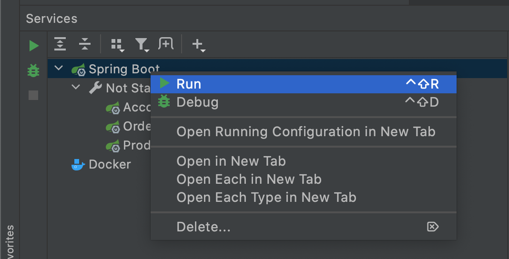

# GraphQL Microservices Example with Apollo Gateway / Schema Federation #


## Services ##

- Product Service [here](product-service/README.md)
- Account Service [here](account-service/README.md)
- Order Service [here](order-service/README.md)

## Playground  ##

- Gateway [http://localhost:4000/playground](http://localhost:4000/playground)

Single Services:

- Product-Service [http://localhost:8081/playground](http://localhost:8081/playground)
- Account-Service [http://localhost:8082/playground](http://localhost:8082/playground)
- Order-Service [http://localhost:8083/playground](http://localhost:8083/playground)

## Query ##

### Query by Order ###

You can query order ids from 1-3

```
{
  order(id: "1") {
    id
    title
    account {
      id
      firstname
      lastname
      orders {
        id
        title
      }
    }
    products {
      name
      description
      price
    }
  }
}
```

### Query by Account ###

You can query account ids from 1-2

```
{
  account(id: "1") {
    firstname
    lastname
    orders {
      id
      title
      products {
        id
        name
        description
      }
    }
  }
}
```

## Run ##

### Run with IntelliJ ###

Wait for maven import and click on "Show run configurations in Services"


Then you can start all Services with one click



### Run with Maven Wrapper ###

It also possible to start services with Maven. This must be done in every service subfolder.

```
./mvnw spring-boot:run -f product-service/pom.xml
./mvnw spring-boot:run -f account-service/pom.xml
./mvnw spring-boot:run -f order-service/pom.xml
```

### Run Apollo Gateway ###

Last, start Apollo Gateway in subfolder: "graphql-gateway". See [here](graphql-gateway/README.md).

```
npm --prefix graphql-gateway install
npm --prefix graphql-gateway start
```

## References ##

- https://www.apollographql.com/docs/federation/
- https://github.com/apollographql/federation-jvm
